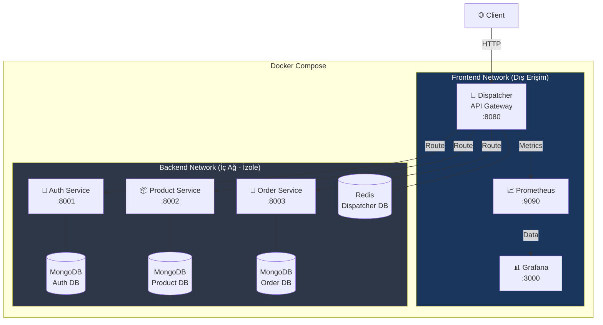
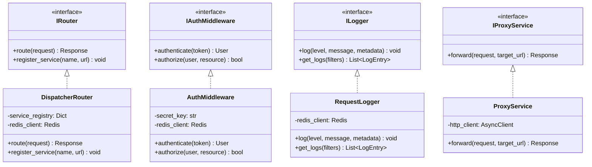

# 🛒 E-Commerce Microservice Architecture

**Kocaeli Üniversitesi — Bilişim Sistemleri Mühendisliği**  
**Yazılım Geliştirme Laboratuvarı-II — Proje 1**

## 👥 Ekip Üyeleri

| İsim | GitHub |
|------|--------|
| Kişi A | [@kisiA](https://github.com/kisiA) |
| Kişi B | [@kisiB](https://github.com/kisiB) |

**Tarih:** Mart 2026

---

## 📋 İçindekiler

1. [Giriş](#-giriş)
2. [Mimari Tasarım](#-mimari-tasarım)
3. [Servisler](#-servisler)
4. [Richardson Olgunluk Modeli](#-richardson-olgunluk-modeli)
5. [Veri Tabanı Tasarımı](#-veri-tabanı-tasarımı)
6. [Docker & Orkestrasyon](#-docker--orkestrasyon)
7. [Test Stratejisi](#-test-stratejisi)
8. [Performans Testleri](#-performans-testleri)
9. [Ekran Görüntüleri](#-ekran-görüntüleri)
10. [Sonuç ve Tartışma](#-sonuç-ve-tartışma)

---

## 📖 Giriş

Bu proje, modern yazılım geliştirme süreçlerinin temelini oluşturan **Mikroservis Mimarisi** ve servisler arası trafik yönetimini sağlayan bir **Dispatcher (API Gateway)** yazılımının uçtan uca geliştirilmesini kapsamaktadır.

### Problemin Tanımı

Monolitik uygulamalarda ölçeklenebilirlik, bağımsız dağıtım ve hata izolasyonu gibi konularda yaşanan sorunlara çözüm olarak, bir e-ticaret senaryosu üzerinde mikroservis tabanlı mimari tasarlanmıştır.

### Amaç

- Bağımsız servislerin orkestrasyonunu sağlayan bir Dispatcher geliştirmek
- TDD (Test-Driven Development) ile güvenilir yazılım üretmek
- Docker ile servis izolasyonu ve kolay dağıtım sağlamak
- Yük testleri ile sistem performansını doğrulamak

---

## 🏗 Mimari Tasarım

### Sistem Mimarisi



### Sınıf Diyagramı



> **Not:** Rapor içeriği proje geliştikçe güncellenecektir.

---

## 🛠 Teknoloji Yığını

| Bileşen | Teknoloji |
|---------|-----------|
| Programlama Dili | Python 3.11 |
| Web Framework | FastAPI |
| Test Framework | pytest |
| Dispatcher DB | Redis 7 |
| Servis DB'leri | MongoDB 7 |
| Konteyner | Docker + Docker Compose |
| Monitoring | Prometheus + Grafana |
| Yük Testi | Locust |

---

## 🚀 Kurulum ve Çalıştırma

```bash
# Projeyi klonla
git clone https://github.com/KULLANICI/microservice-ecommerce.git
cd microservice-ecommerce

# Tüm sistemi ayağa kaldır
docker-compose up --build

# Erişim noktaları:
# Dispatcher API:  http://localhost:8080
# Grafana:         http://localhost:3000
# Prometheus:      http://localhost:9090
```

---

*Bu README, proje geliştirildikçe güncellenecektir.*
