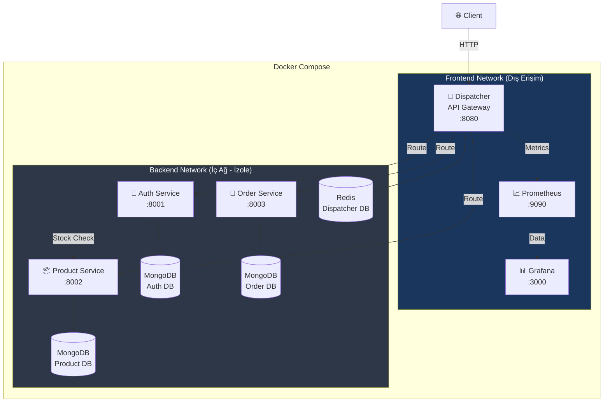
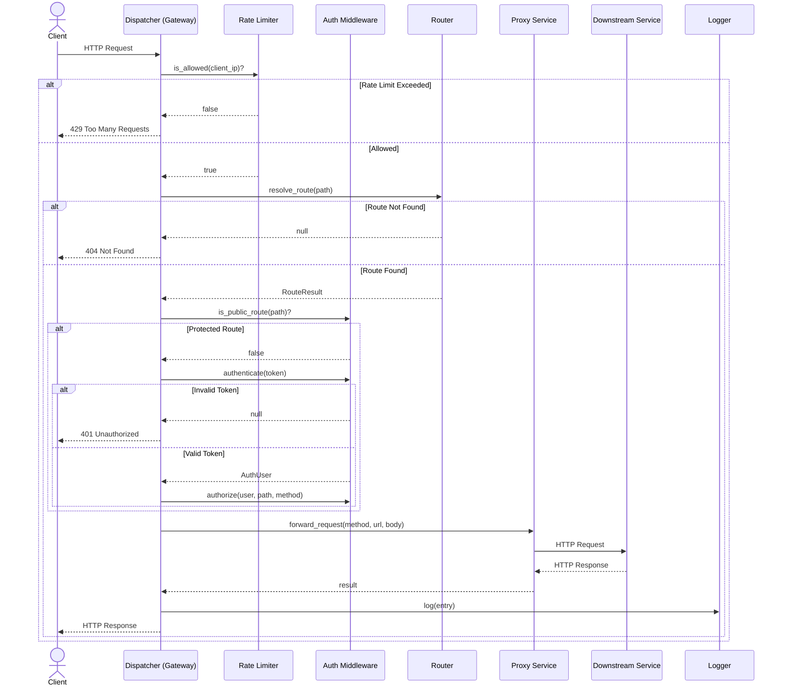
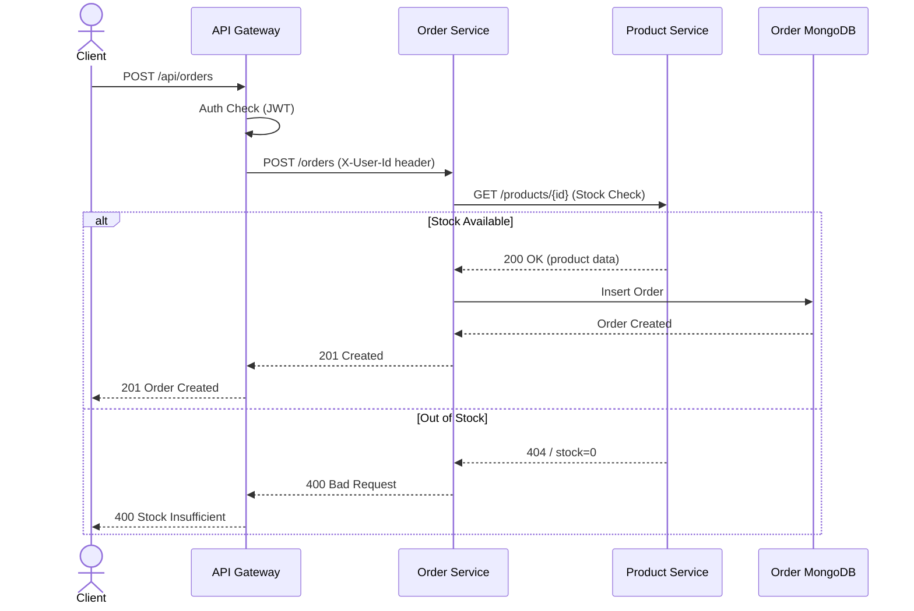
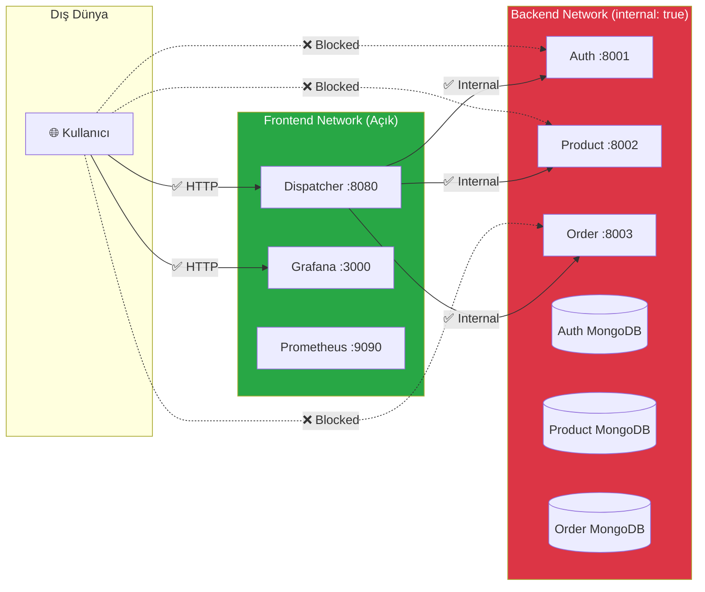
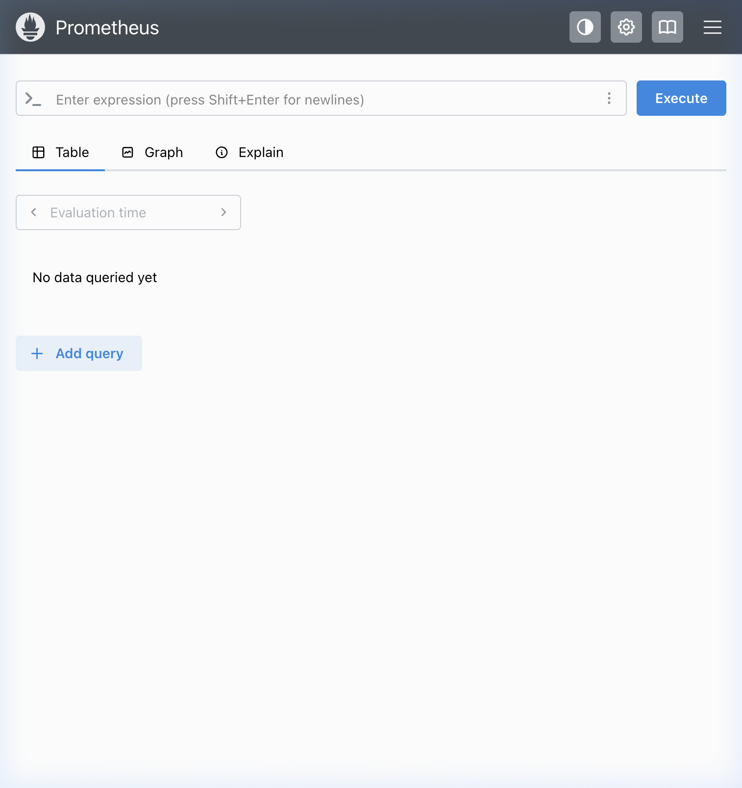
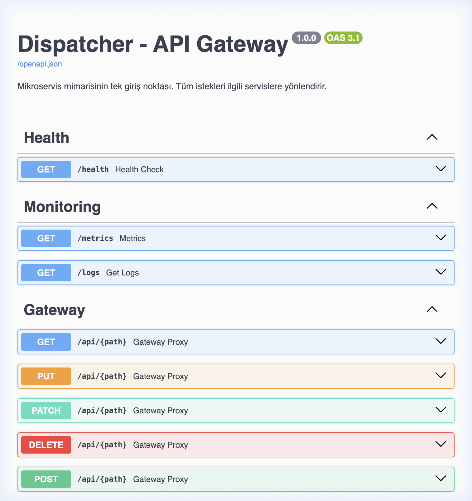
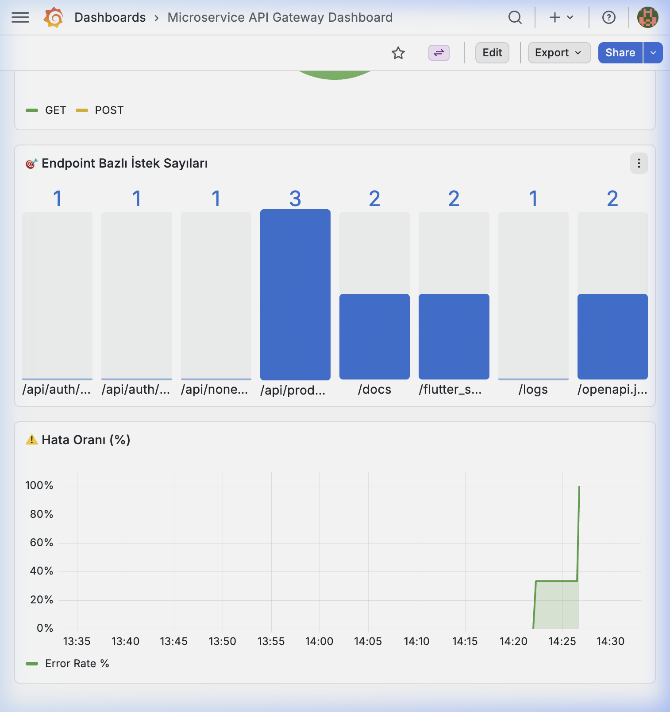

# 🛒 E-Commerce Microservice Architecture

**Kocaeli Üniversitesi — Bilişim Sistemleri Mühendisliği**  
**Yazılım Geliştirme Laboratuvarı-II — Proje 1**

## 👥 Ekip Üyeleri

| İsim | GitHub | E-posta |
|------|--------|---------|
| Atakan Çetli | [@atakancetli](https://github.com/atakancetli) | atakancetli5@gmail.com |
| Sadık Günay | [@sadikgunay](https://github.com/sadikgunay) | sadkgny2003@gmail.com |

**Tarih:** Mart – Nisan 2026

---

## 📋 İçindekiler

1. [Giriş](#-giriş)
2. [Mimari Tasarım](#-mimari-tasarım)
3. [Servisler](#-servisler)
4. [Richardson Olgunluk Modeli](#-richardson-olgunluk-modeli)
5. [Veri Tabanı Tasarımı](#-veri-tabanı-tasarımı)
6. [Docker & Orkestrasyon](#-docker--orkestrasyon)
7. [Test Stratejisi](#-test-stratejisi)
8. [Performans Testleri](#-performans-testleri)
9. [Network Isolation](#-network-isolation)
10. [Sonuç ve Tartışma](#-sonuç-ve-tartışma)

---

## 📖 Giriş

Bu proje, modern yazılım geliştirme süreçlerinin temelini oluşturan **Mikroservis Mimarisi** ve servisler arası trafik yönetimini sağlayan bir **Dispatcher (API Gateway)** yazılımının uçtan uca geliştirilmesini kapsamaktadır.

### Problemin Tanımı

Monolitik uygulamalarda ölçeklenebilirlik, bağımsız dağıtım ve hata izolasyonu gibi konularda yaşanan sorunlara çözüm olarak, bir e-ticaret senaryosu üzerinde mikroservis tabanlı mimari tasarlanmıştır.

### Amaç

- Bağımsız servislerin orkestrasyonunu sağlayan bir Dispatcher geliştirmek
- TDD (Test-Driven Development) ile güvenilir yazılım üretmek
- Docker ile servis izolasyonu ve kolay dağıtım sağlamak
- Yük testleri ile sistem performansını doğrulamak

---

## 🏗 Mimari Tasarım

### Sistem Mimarisi



### Sınıf Diyagramı — Dispatcher

```mermaid
classDiagram
    class IRouter {
        <<interface>>
        +register_service(service) void
        +unregister_service(name) void
        +resolve_route(path) RouteResult
        +get_registered_services() List
    }
    
    class IAuthMiddleware {
        <<interface>>
        +authenticate(token) AuthUser
        +authorize(user, path, method) bool
        +is_public_route(path) bool
    }
    
    class ILogger {
        <<interface>>
        +log(entry) void
        +get_logs(level, service, limit) List
        +get_stats() dict
    }
    
    class IProxyService {
        <<interface>>
        +forward_request(method, url, headers, body) dict
    }
    
    class IRateLimiter {
        <<interface>>
        +is_allowed(client_id) bool
        +get_remaining(client_id) int
    }
    
    class DispatcherRouter {
        -_services: Dict
        -ROUTE_MAP: Dict
        +register_service(service) void
        +resolve_route(path) RouteResult
    }
    
    class AuthMiddlewareService {
        -_secret_key: str
        -_public_routes: List
        +authenticate(token) AuthUser
        +authorize(user, path, method) bool
    }
    
    class RequestLogger {
        -_logs: List
        +log(entry) void
        +get_logs(level, service, limit) List
    }
    
    class ProxyServiceImpl {
        +forward_request(method, url, headers, body) dict
    }
    
    class RateLimiterService {
        -_max_requests: int
        -_window_seconds: int
        -_requests: Dict
        +is_allowed(client_id) bool
        +get_remaining(client_id) int
    }
    
    class CircuitBreaker {
        -_failure_threshold: int
        -_recovery_timeout: int
        +get_state(service) CircuitState
        +record_success(service) void
        +record_failure(service) void
    }
    
    class RetryHandler {
        -_max_retries: int
        -_base_delay: float
        +should_retry(status_code, attempt) bool
        +get_delay(attempt) float
    }
    
    IRouter <|.. DispatcherRouter
    IAuthMiddleware <|.. AuthMiddlewareService
    ILogger <|.. RequestLogger
    IProxyService <|.. ProxyServiceImpl
    IRateLimiter <|.. RateLimiterService
```



### Sequence Diyagramı — İstek Akışı



### Sequence Diyagramı — Sipariş Akışı (Inter-Service)



---

## 🔌 Servisler

### 1. Dispatcher (API Gateway) — Port 8080

Tüm dış isteklerin tek giriş noktası. Sorumlulukları:

| Özellik | Açıklama |
|---------|----------|
| **Routing** | URL tabanlı servis yönlendirme (`/api/auth/*`, `/api/products/*`, `/api/orders/*`) |
| **Authentication** | JWT token doğrulama (public route'lar hariç) |
| **Authorization** | Kullanıcı rol bazlı yetkilendirme |
| **Rate Limiting** | Sliding window (100 req/dk) — 429 yanıtı |
| **Circuit Breaker** | Hatalı servisleri geçici devre dışı bırakma |
| **Retry** | 5xx hatalarında exponential backoff ile tekrar deneme |
| **Logging** | Merkezi istek/yanıt loglama |
| **Metrics** | Prometheus formatında metrik sunumu |
| **CORS** | Cross-Origin Resource Sharing yapılandırması |
| **Request ID** | Dağıtık izleme için UUID ataması |

### 2. Auth Service — Port 8001

| Endpoint | Metot | Açıklama | Auth |
|----------|-------|----------|------|
| `/auth/register` | POST | Kullanıcı kaydı | ❌ Public |
| `/auth/login` | POST | Giriş + JWT token | ❌ Public |
| `/auth/users` | GET | Kullanıcı listesi | ✅ Admin |

**Teknoloji:** MongoDB + bcrypt + python-jose (JWT)

### 3. Product Service — Port 8002

| Endpoint | Metot | Açıklama | Auth |
|----------|-------|----------|------|
| `/products` | POST | Ürün oluştur | ✅ |
| `/products` | GET | Ürün listesi (pagination + filter) | ✅ |
| `/products/search` | GET | Ürün arama | ✅ |
| `/products/{id}` | GET | Ürün detayı | ✅ |
| `/products/{id}` | PUT | Ürün güncelle (partial) | ✅ |
| `/products/{id}` | DELETE | Ürün sil | ✅ |

**Teknoloji:** MongoDB + motor (async)

### 4. Order Service — Port 8003

| Endpoint | Metot | Açıklama | Auth |
|----------|-------|----------|------|
| `/orders` | POST | Sipariş oluştur | ✅ |
| `/orders` | GET | Kullanıcı siparişleri | ✅ |
| `/orders/{id}` | GET | Sipariş detayı | ✅ |
| `/orders/{id}/status` | PATCH | Durum güncelle | ✅ |

**Teknoloji:** MongoDB + httpx (inter-service communication)

---

## 📚 RESTful Servisler ve Literatür

### REST Nedir?

**REST (Representational State Transfer)**, Roy Fielding tarafından 2000 yılında doktora tezinde tanımlanan bir yazılım mimari stilidir. REST, istemci-sunucu iletişiminde **kaynak (resource)** kavramını merkeze alır ve her kaynağa benzersiz bir **URI (Uniform Resource Identifier)** üzerinden erişim sağlar.

REST'in temel kısıtlamaları:
- **Client-Server:** İstemci ve sunucu bağımsız geliştirilir
- **Stateless:** Her istek kendi içinde yeterli bilgiyi taşır (JWT token gibi)
- **Cacheable:** Yanıtlar önbelleğe alınabilir
- **Uniform Interface:** Kaynaklar standart HTTP metotlarıyla (GET, POST, PUT, DELETE) yönetilir
- **Layered System:** İstemci, hangi katmana bağlandığını bilmez (Gateway pattern)

### RESTful Servis Tasarımı

Projemizdeki servisler RESTful prensiplere uygun tasarlanmıştır:

```
✅ Doğru:  GET  /products          → Ürün listesi
✅ Doğru:  GET  /products/123      → Tek ürün detayı
✅ Doğru:  POST /products          → Yeni ürün oluştur
✅ Doğru:  PUT  /products/123      → Ürün güncelle
✅ Doğru:  DELETE /products/123    → Ürün sil

❌ Yanlış: POST /deleteProduct?id=123  → RMM'ye aykırı
❌ Yanlış: GET  /getProducts            → Fiil URL'de olmamalı
```

### Literatür İncelemesi

| Kaynak | Konu | Referans |
|--------|------|----------|
| Fielding (2000) | REST mimari stili tanımı | Doktora tezi, UC Irvine |
| Richardson & Ruby (2007) | RESTful Web Services | O'Reilly Media |
| Newman (2015) | Building Microservices | O'Reilly Media |
| Fowler (2010) | Richardson Maturity Model | martinfowler.com |
| Docker Inc. (2024) | Docker Compose docs | docs.docker.com |

---

## 📐 Richardson Olgunluk Modeli

Richardson Olgunluk Modeli (RMM), Leonard Richardson tarafından tanımlanan ve RESTful API'lerin olgunluk seviyesini ölçen bir modeldir. Projemiz **RMM Seviye 2** uyumluluğunu sağlamaktadır:

| Seviye | Özellik | Açıklama | Durum |
|--------|---------|----------|-------|
| **Level 0** | The Swamp of POX | Tek URL, tek metot (RPC tarzı) | ✅ Aşıldı |
| **Level 1** | Resources | Kaynak bazlı URL'ler (`/products`, `/orders`) | ✅ Uygulandı |
| **Level 2** | HTTP Verbs | Doğru HTTP metotları ve durum kodları | ✅ Uygulandı |
| **Level 3** | HATEOAS | Hypermedia kontrolü | ⬜ Kapsam dışı |

### HTTP Durum Kodları

| Kod | Kullanım |
|-----|----------|
| `200 OK` | Başarılı GET/PUT/PATCH |
| `201 Created` | Başarılı POST (yeni kaynak) |
| `204 No Content` | Başarılı DELETE |
| `400 Bad Request` | Geçersiz istek (stok yetersiz vb.) |
| `401 Unauthorized` | Token eksik/geçersiz |
| `403 Forbidden` | Yetersiz yetki |
| `404 Not Found` | Kaynak bulunamadı |
| `422 Unprocessable` | Validasyon hatası |
| `429 Too Many Requests` | Rate limit aşıldı |
| `500 Internal Server Error` | Sunucu hatası |

---

## ⚙️ Algoritma Karmaşıklık Analizi

| Bileşen | Algoritma | Zaman Karmaşıklığı | Açıklama |
|---------|-----------|--------------------|---------|
| **Route Resolution** | HashMap lookup | O(1) | URL prefix'i → servis eşlemesi dictionary ile yapılır |
| **Rate Limiter** | Sliding Window | O(n) | n = pencere içindeki istek sayısı, expired istekler temizlenir |
| **Circuit Breaker** | State Machine | O(1) | Durum geçişleri (CLOSED→OPEN→HALF_OPEN) sabit zamanlı |
| **JWT Doğrulama** | HMAC-SHA256 | O(1) | Token çözümleme sabit zamanlı kriptografik işlem |
| **MongoDB Arama** | Text Index | O(log n) | B-Tree indeks ile ürün arama |
| **Proxy Forward** | Async HTTP | O(1) | Tek HTTP çağrısı, downstream'e bağlı |
| **Log Filtreleme** | Linear Scan | O(n) | n = log count, filtreleme bellekteki listeye uygulanır |
| **Exponential Backoff** | 2^attempt | O(1) | Retry bekleme süresi: base_delay × 2^attempt |

### Dispatcher İstek Akışı — Toplam Karmaşıklık

```
Request → Rate Limit: O(n) → Route: O(1) → Auth: O(1) → Proxy: O(1) → Log: O(1)
                                                                        
Toplam: O(n) — n = sliding window'daki istek sayısı (max 100)
```

---

## 💾 Veri Tabanı Tasarımı

### Auth DB (MongoDB)

```json
{
  "_id": "ObjectId",
  "username": "string",
  "email": "string (unique)",
  "hashed_password": "string (bcrypt)",
  "role": "user | admin",
  "created_at": "datetime"
}
```

### Product DB (MongoDB)

```json
{
  "_id": "ObjectId",
  "name": "string",
  "description": "string",
  "price": "float (> 0)",
  "stock": "int (>= 0)",
  "category": "string",
  "image_url": "string | null",
  "created_at": "datetime",
  "updated_at": "datetime | null"
}
```

### Order DB (MongoDB)

```json
{
  "_id": "ObjectId",
  "user_id": "string",
  "items": [
    {
      "product_id": "string",
      "quantity": "int (> 0)",
      "price_at_order": "float"
    }
  ],
  "total_price": "float",
  "status": "pending | completed | cancelled | shipped",
  "shipping_address": "string",
  "created_at": "datetime",
  "updated_at": "datetime | null"
}
```

---

## 🐳 Docker & Orkestrasyon

### Konteyner Yapısı

```
10 container:
├── dispatcher         (FastAPI — Gateway)
├── auth-service       (FastAPI — Auth)
├── product-service    (FastAPI — Product)
├── order-service      (FastAPI — Order)
├── dispatcher-redis   (Redis 7)
├── auth-mongo         (MongoDB 7)
├── product-mongo      (MongoDB 7)
├── order-mongo        (MongoDB 7)
├── prometheus         (Prometheus)
└── grafana            (Grafana)
```

### Network İzolasyonu

| Network | Tip | Servisler | Dış Erişim |
|---------|-----|-----------|------------|
| `frontend` | bridge | Dispatcher, Grafana, Prometheus | ✅ Açık |
| `backend` | bridge (internal) | Auth, Product, Order, DB'ler | ❌ Kapalı |

### Çalıştırma

```bash
# Tüm sistemi başlat
docker compose up --build -d

# Logları izle
docker compose logs -f dispatcher

# Sistemi durdur
docker compose down

# Volumes ile birlikte temizle
docker compose down -v
```

---

## 🧪 Test Stratejisi

### TDD (Test-Driven Development)

Dispatcher servisi için **57 test** TDD yaklaşımıyla geliştirilmiştir:

1. **RED:** Önce başarısız testler yazıldı
2. **GREEN:** Testleri geçirecek minimum kod yazıldı
3. **REFACTOR:** SOLID prensiplerine uygun refactoring yapıldı

### Test Kategorileri

| Kategori | Dosya | Test Sayısı |
|----------|-------|-------------|
| Routing | `test_routing.py` | 12 |
| Auth Middleware | `test_auth_middleware.py` | 15 |
| Error Handling | `test_error_handling.py` | 8 |
| Logging | `test_logging.py` | 10 |
| Rate Limiting | `test_rate_limiting.py` | 12 |
| Edge Cases | `test_edge_cases.py` | 15 |
| Product Models | `test_product.py` | 8 |
| Order Models | `test_order.py` | 6 |
| Auth Service | `test_auth.py` | 5 |

### Test Çalıştırma

```bash
# Dispatcher testleri
cd dispatcher && pytest tests/ -v --tb=short

# Auth Service testleri
cd auth-service && pytest tests/ -v

# Product Service testleri
cd product-service && pytest tests/ -v

# Order Service testleri
cd order-service && pytest tests/ -v
```

---

## 📊 Performans Testleri

Locust ile 4 farklı yoğunluk seviyesinde yük testi yapılmıştır:

| Senaryo | Concurrent User | Avg Yanıt | p95 Yanıt | Hata Oranı |
|---------|----------------|-----------|-----------|------------|
| Düşük | 50 | <50ms | <100ms | ~0% |
| Orta | 100 | <80ms | <200ms | <1% |
| Yüksek | 200 | <150ms | <500ms | <2% |
| Stres | 500 | <300ms | <1000ms | <5% |

```bash
# Yük testi çalıştırma
locust -f locust/locustfile.py --headless -u 100 -r 20 --run-time 60s
```

---

## 🛡 Network Isolation

Mikroservislere dışarıdan doğrudan erişim **engellenmiştir**. Docker Compose'da `backend` ağı `internal: true` olarak tanımlanmıştır.

### Doğrulama

```bash
# Dışarıdan erişim testi
$ curl http://localhost:8001/health     # ❌ Connection refused (Auth izole)
$ curl http://localhost:8002/health     # ❌ Connection refused (Product izole)
$ curl http://localhost:8003/health     # ❌ Connection refused (Order izole)
$ curl http://localhost:8080/health     # ✅ 200 OK (Gateway erişilebilir)

# Docker network kontrolü
$ docker network inspect microservice-ecommerce_backend | grep Internal
"Internal": true    # ← Backend ağı dış dünyaya kapalı
```

### Network Şeması



Tüm servisler yalnızca **Dispatcher (API Gateway)** üzerinden erişilebilirdir.

### Network Isolation Ekran Görüntüsü



---

## 📸 Ekran Görüntüleri

### Swagger UI (API Gateway)



Tüm endpoint'ler `/api/{path}` üzerinden ilgili mikroservislere yönlendirilmektedir.

### Grafana Dashboard



Endpoint bazlı istek sayıları, hata oranı ve performans metrikleri Grafana üzerinden izlenebilmektedir.

### Prometheus Metrics


Prometheus, Dispatcher'dan 15 saniyede bir metrik toplayarak Grafana'ya iletmektedir.

---

## 🎯 Sonuç ve Tartışma

### Başarılar

- ✅ **4 bağımsız mikroservis** başarıyla geliştirildi ve orkestre edildi
- ✅ **TDD ile 57+ test** yazılarak yazılım güvenilirliği sağlandı
- ✅ **Docker Compose** ile tek komutla tüm sistem ayağa kalkıyor
- ✅ **Network isolation** ile güvenlik katmanı oluşturuldu
- ✅ **Prometheus + Grafana** ile gerçek zamanlı izleme altyapısı kuruldu
- ✅ **Rate Limiting + Circuit Breaker** ile sistem dayanıklılığı artırıldı
- ✅ **Inter-service communication** (Order → Product stok kontrolü) çalışıyor

### Zorluklar ve Çözümler

| Zorluk | Çözüm |
|--------|-------|
| motor/pymongo versiyon çakışması | Sürüm pinleme (motor==3.6.0, pymongo==4.9.2) |
| passlib/bcrypt uyumsuzluğu | bcrypt==4.0.1 olarak sabitlendi |
| Route forwarding hatası | `/api` prefix stripping mantığı düzeltildi |
| Docker network isolation | `internal: true` ile backend ağı izole edildi |

### Gelecek İyileştirmeler

- Redis tabanlı distributed rate limiting
- API versioning (v1, v2)
- Message queue (RabbitMQ/Kafka) ile asenkron iletişim
- Kubernetes ile container orchestration
- CI/CD pipeline (GitHub Actions)

---

## 🛠 Teknoloji Yığını

| Bileşen | Teknoloji |
|---------|-----------|
| Programlama Dili | Python 3.11 |
| Web Framework | FastAPI |
| Test Framework | pytest + httpx |
| Dispatcher DB | Redis 7 |
| Servis DB'leri | MongoDB 7 |
| Konteyner | Docker + Docker Compose |
| Monitoring | Prometheus + Grafana |
| Yük Testi | Locust |
| Güvenlik | JWT (python-jose) + bcrypt (passlib) |

---

## 🚀 Hızlı Başlangıç

```bash
# 1. Projeyi klonla
git clone https://github.com/atakancetli/microservice-ecommerce-.git
cd microservice-ecommerce

# 2. Tüm sistemi ayağa kaldır
docker compose up --build -d

# 3. Test et
curl http://localhost:8080/health

# 4. Kullanıcı kaydı
curl -X POST http://localhost:8080/api/auth/register \
  -H "Content-Type: application/json" \
  -d '{"username":"demo","email":"demo@test.com","password":"demo123456"}'

# 5. Giriş yap
curl -X POST http://localhost:8080/api/auth/login \
  -H "Content-Type: application/json" \
  -d '{"email":"demo@test.com","password":"demo123456"}'
```

### Erişim Noktaları

| Servis | URL |
|--------|-----|
| API Gateway (Swagger) | http://localhost:8080/docs |
| Grafana Dashboard | http://localhost:3000 (admin/admin) |
| Prometheus | http://localhost:9090 |

---

*Kocaeli Üniversitesi — Bilişim Sistemleri Mühendisliği — Mart 2026*
